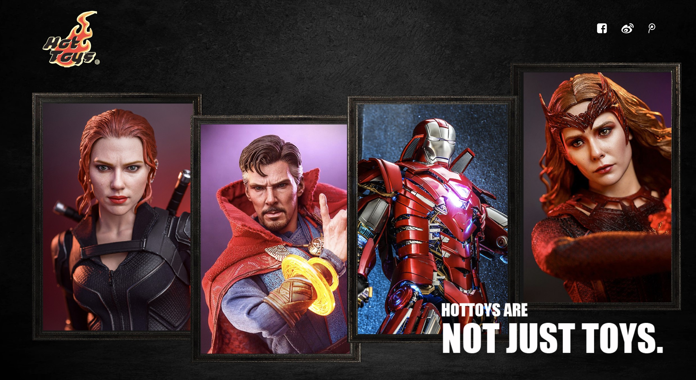

# Hot toys E-commerce Store - Angular

Demo link: [https://angular-store-frontend.vercel.app/](https://angular-store-frontend.vercel.app/)

As a Marval fans, I always admire Hot Toys because of their high quality products. In this project, I took their products as inspiration and re-designed their website by using one of the JS framework - [Angular](https://angular.io/).

- [Hot toys E-commerce Store - Angular](#hot-toys-e-commerce-store---angular)
  - [Front-end Design](#front-end-design)
  - [Usage](#usage)
    - [1. Install Dependency](#1-install-dependency)
    - [2. Development server](#2-development-server)
    - [3. Build](#3-build)
    - [4. Production server](#4-production-server)
  - [Data Handling](#data-handling)
  - [Declaimers](#declaimers)

## Front-end Design

I started this project from stretch and finished UI/UX design before diving into coding. Here is the link of my high-fidelity design.

Figma Link: [https://www.figma.com/file/bMlv7d1c26XRf1qjzpKuRk/Udacity-Apps?node-id=87%3A2346](https://www.figma.com/file/bMlv7d1c26XRf1qjzpKuRk/Udacity-Apps?node-id=87%3A2346)

## Usage

This project was generated with [Angular CLI](https://github.com/angular/angular-cli) version 14.0.6.

### 1. Install Dependency

After clone the project, run `npm install` to install all dependencies this project needs.

### 2. Development server

Run `ng serve` for a dev server. Navigate to `http://localhost:4200/`. The application will automatically reload if you change any of the source files.

### 3. Build

Run `ng build` to build the project. The build artifacts will be stored in the `dist/` directory.

### 4. Production server

Run `npm run start` to start a production server. If you don't set up `process.env.PORT` in environment, the default port is `8081`. You can change the port in `server.js`.

## Data Handling

Data for products was put on another Heroku app as an Express server to handle requests and responses for data fetching.

Cart data and order data will be stored in `localStorage` of your browser.

## Declaimers

- This project is only for porfolio & learning purpose, not for commercial usage.
- The copyrights of visual and text contents belong to [Hot Toys Limited](http://www.hottoys.com.hk/)
